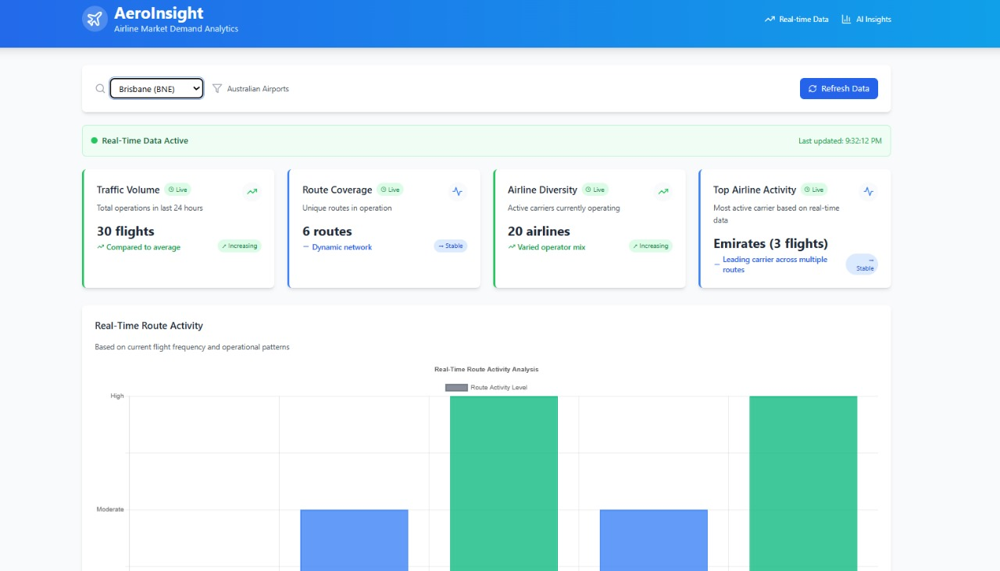

# ✈️ AeroInsight — Airline Booking Market Demand Analytics

AeroInsight is a real-time web dashboard that helps hospitality operators (like hostel chains) analyze flight market demand across major Australian cities. This project was built in response to a real-world challenge — to design a **fast, API-powered airline market analytics tool** using only free tools, in under 24 hours.

---

Features:
- Live flight demand per airport
- Popular routes
- Active airlines
- AI-generated market insights

---

## 🎯 Core Features

| ✅ Requirement               | 🔍 What This App Does                                                                 |
|-----------------------------|-----------------------------------------------------------------------------------------|
| **1. Data Scraping / API**  | Integrates **AviationStack** API for real-time airline data (free tier)                |
| **2. AI Insights**          | Uses **Gemini 1.5 Flash** to extract insights from real data (popular routes, trends)  |
| **3. Web Interface**        | Built with **React + Tailwind**, featuring live charts, cards, dropdown filters        |
| **4. Data Processing**      | Cleans and structures raw flight data for analysis and visualization                   |
| **5. Clean Output**         | Displays results via charts, route analytics, and demand insights                     |

---

## 🖼️ Sample Screenshot

---

## 🛠️ Tech Stack

| Layer     | Tech                                 |
|-----------|--------------------------------------|
| Frontend  | React, TypeScript, Vite, Tailwind CSS|
| Backend   | Node.js + Express                    |
| APIs      | AviationStack, Google Gemini, OpenWeatherMap |
| AI Model  | Gemini 1.5 Flash (Google Generative AI) |
| Hosting   | *(Optional: ready to deploy on Vercel or Netlify)* |

---

## ⚙️ How to Run It Locally

1. Clone the project
git clone https://github.com/Sahithi-Kallem/aeroinsight.git
cd aeroinsight

2. Configure environment variables
Create a .env file in the project root:
# Backend
AVIATIONSTACK_API_KEY=your_aviationstack_api_key

# Frontend (Vite)
VITE_GEMINI_API_KEY=your_gemini_api_key
VITE_WEATHER_API_KEY=your_openweather_api_key3. Run the backend

3. Run the backend
cd backend
npm install
node server.js

4. Run the frontend
cd frontend
npm install
npm run dev
Visit http://localhost:5173
